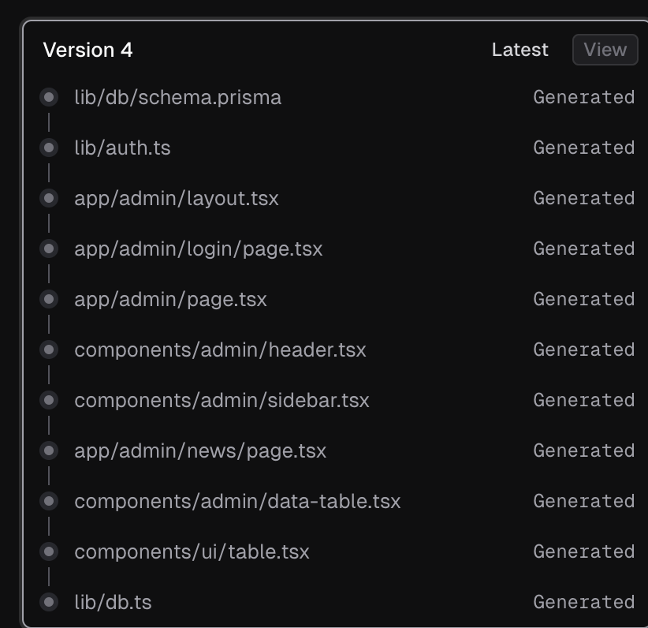

这个项目提供了一个完整的全栈网站框架，
UI设计，要求简洁，交互响应友好，符合国际标准，响应式，支持多语言切换，支持多设备兼容性，跨浏览器兼容性，

- 创建虚拟环境：
python3 -m venv venv 
- 激活虚拟环境
source venv/bin/activate
- 推出虚拟环境
deactivate

- 关于简洁UI的参考网站：https://kalogirourania.com/

- 无效依赖排查：【depcheck】

## todo:
- 整体网站项目的托管。【阿里云服务器，最少1000+¥/年。vercel免费】
- 设置页面404 重定向-建设中...
- 构建工具配置优化（支持热更新、代码分割、懒记载、环境变量。。。）、性能优化、无效依赖排查和删除【depcheck】
- 工具：todo
    - 通过网址，检索公司业务和关键决策人
    - 帮助决策选型
    - 费用预估

## 主要特性
- 🌐 中英文双语支持
- 📱 响应式设计，完美适配移动端和桌面端
- 🎨 现代化UI设计，基于shadcn/ui组件库
- 🚀 快速的前端渲染
- 📝 在线联系表单
- 🔄 实时内容更新

## 全栈开发简洁版

### 技术栈说明
这个全栈网站使用了以下免费的主流技术栈：
1. **前端框架**：Next.js - React框架，提供服务端渲染和静态生成能力
2. **样式**：Tailwind CSS - 实用优先的CSS框架
3. **UI组件**：shadcn/ui - 基于Radix UI的高质量组件库
4. **后端**：Next.js的服务器组件和服务器操作(Server Actions)
5. **部署平台**：Vercel - 提供免费的托管服务

### 功能特点
1. **响应式设计**：在所有设备上都能良好显示
2. **两个主要页面**：
    1. 首页：包含英雄区域、特性展示和号召行动区域
    2. 联系我们页面：包含联系表单和联系信息
    3. 新闻页面、
    4. 产品与服务页面、
    5. 学习中心页面、
    6. 成果展示页面
3. **服务器操作**：处理联系表单提交
4. **组件化结构**：易于维护和扩展


### 部署步骤
1. 在GitHub上创建一个新仓库并上传代码
2. 注册Vercel账号(免费)：[https://vercel.com](https://vercel.com)
3. 在Vercel上导入GitHub仓库
4. Vercel会自动检测Next.js项目并配置构建设置
5. 点击"Deploy"按钮完成部署
6. 部署完成后，Vercel会提供一个域名(例如：your-project.vercel.app)


### 本地开发
1. 克隆仓库到本地
2. 安装依赖：`npm install`
3. 启动开发服务器：`npm run dev`
4. 在浏览器中访问：`http://localhost:3000`


## 优化网站UI设计与功能增强
### 1. UI设计优化
- **简洁现代设计**：采用了更加简洁、现代的设计风格，减少视觉干扰
- **一致性**：在所有页面保持一致的设计语言和组件样式
- **动画效果**：添加了平滑的过渡动画，提升用户体验
- **色彩方案**：使用了更加协调的色彩方案，支持深色模式
- **卡片布局**：使用卡片组件展示内容，提高可读性和视觉层次


### 2. 多语言支持
- 实现了完整的中英文双语支持
- 添加了语言切换器，可以在任何页面切换语言
- 使用上下文API管理语言状态，确保全站一致性
- 本地存储用户语言偏好


### 3. 响应式设计
- 所有页面完全响应式，适配从手机到桌面的各种设备
- 针对移动设备优化了导航和布局
- 使用Tailwind CSS的响应式类实现不同屏幕尺寸的布局调整


### 4. 主题支持
- 添加了亮色/暗色主题切换功能
- 支持系统主题自动检测
- 主题切换无闪烁


### 5. 新增页面
- **新闻动态页面**：展示公司新闻和行业动态
- **产品与服务页面**：展示公司提供的产品和服务
- **学习中心页面**：提供教程、指南和资源
- **成果展示页面**：展示项目案例和客户评价


### 6. 交互优化
- 添加了平滑的页面过渡动画
- 改进了导航体验，当前页面高亮显示
- 添加了选项卡组件，方便内容分类浏览
- 优化了表单交互和反馈


### 7. 跨浏览器兼容性
- 使用标准CSS属性和特性
- 添加了必要的前缀和回退方案
- 使用现代JavaScript特性，同时确保广泛兼容性


### 8. 性能优化
- 使用Next.js的图像优化功能
- 组件懒加载
- 优化动画性能


## 项目结构补充说明
```plaintext
├── app/                      # Next.js 应用主目录
│   ├── layout.tsx           # 根布局组件
│   ├── page.tsx             # 首页组件
│   ├── globals.css          # 全局样式
│   ├── actions.ts           # 服务器端动作【后端】
│   ├── contact/             # 联系页面目录
│   │   └── page.tsx
│   ├── news/               # 新闻页面目录
│   │   └── page.tsx
│   ├── products/          # 产品页面目录
│   │   └── page.tsx
│   ├── learning/         # 学习中心页面目录
│   │   └── page.tsx
│   └── showcase/        # 成果展示页面目录
│       └── page.tsx
│
├── components/          # 共享组件目录（前端）
│   ├── header.tsx      # 页头组件
│   ├── footer.tsx      # 页脚组件
│   ├── language-switcher.tsx  # 语言切换组件
│   ├── theme-toggle.tsx       # 主题切换组件
│   ├── theme-provider.tsx     # 主题提供者组件
│   └── ui/             # UI组件库
│       ├── avatar.tsx
│       ├── badge.tsx
│       ├── button.tsx
│       ├── card.tsx
│       ├── dropdown-menu.tsx
│       ├── input.tsx
│       ├── label.tsx
│       ├── sheet.tsx
│       ├── tabs.tsx
│       └── textarea.tsx
│
├── lib/                # 工具库目录
│   ├── utils.ts       # 通用工具函数
│   └── i18n/          # 国际化相关
│       ├── context.tsx    # 语言上下文（前端）
│       └── translations.ts # 翻译文件（前端）
│
└── public/            # 静态资源目录
```

### 前端部分 (Client-Side)

前端代码主要包括：
1. **页面组件** 

```plaintext
app/
├── page.tsx          # 首页
├── contact/page.tsx  # 联系页面
├── news/page.tsx     # 新闻页面
├── products/page.tsx # 产品页面
├── learning/page.tsx # 学习中心页面
└── showcase/page.tsx # 成果展示页面
```

2. **共享组件** 
```plaintext
components/
├── header.tsx           # 页头导航
├── footer.tsx           # 页脚
├── language-switcher.tsx # 语言切换器
├── theme-toggle.tsx      # 主题切换器
└── ui/                  # UI组件库
```

3. **前端工具和配置**
```plaintext
lib/
├── i18n/               # 国际化支持
│   ├── context.tsx     # 语言上下文
│   └── translations.ts  # 翻译文件
└── utils.ts            # 通用工具函数
```

### 后端部分 (Server-Side)
后端代码主要包括：
1. **服务器端动作** 
```plaintext
app/
└── actions.ts          # 服务器端动作处理
```

- 处理表单提交
- 处理API请求
- 数据库操作（如果有）


2. **API路由** 
```plaintext
app/api/               # API路由（如果需要可以添加）
└── route.ts          # API端点定义
```

3. **服务器端组件** 
- Next.js的页面默认是服务器端组件
- 使用 'use client' 指令的组件是客户端组件


### 关键技术特性

1. **前端技术栈** 
- Next.js 14+ (React框架)
- Tailwind CSS (样式)
- shadcn/ui (UI组件库)
- Framer Motion (动画)
- next-themes (主题支持)


2. **后端技术栈** 
- Next.js Server Actions (服务器端动作)
- Next.js API Routes (API路由)
- 可扩展的数据库集成


3. **性能优化** 
- 服务器端渲染 (SSR)
- 图片优化
- 代码分割
- 客户端路由


4. **国际化支持** 
- 使用React Context进行语言状态管理
- 支持多语言切换
- 本地化存储


5. **主题支持** 
- 亮色/暗色主题
- 系统主题检测
- 主题持久化


### 部署说明
该项目可以部署到Vercel平台 ，它会自动处理：

- 构建优化
- CDN分发
- SSL证书
- 持续部署
- 环境变量管理


### 扩展建议

1. **后端扩展**
- 添加数据库连接（如MongoDB、PostgreSQL）
- 实现用户认证
- 添加更多API端点


2. **前端扩展**
- 添加更多交互功能
- 实现更多动画效果
- 添加更多页面组件


3. **性能优化**
- 实现增量静态再生成（ISR）
- 添加缓存策略
- 优化资源加载

# 规划后台管理系统
让我规划一个后台管理系统：
1. 需要添加的功能：
- 管理员认证系统（登录、注册、权限管理）
- 内容管理（新闻、产品、学习资源、案例展示）
- 用户管理（管理员账户管理）
- 文件上传管理（图片等媒体文件）
- 多语言内容管理


2. 技术选择：
- 数据库：Prisma + PostgreSQL（可靠且支持关系型数据）
- 认证：NextAuth.js（现在改名为Auth.js）
- 文件存储：Vercel Blob（用于存储上传的图片等文件）
- 表单处理：react-hook-form + zod（表单验证和处理）
- UI组件：继续使用shadcn/ui保持一致性


3. 数据结构设计：
- 用户（管理员）表
- 内容表（新闻、产品等）
- 媒体文件表
- 权限表

## 后台管理系统的基础框架
包含了以下功能：
1. **数据库设计**
- 使用Prisma作为ORM
- 设计了用户、新闻、产品、资源、案例等数据模型
- 支持多语言内容存储

2. **认证系统**
- 使用NextAuth.js实现认证
- 支持邮箱密码登录
- 角色权限控制（管理员和编辑）

3. **后台界面**
- 响应式布局
- 侧边栏导航
- 数据表格展示
- 分页和搜索功能
**添加更多功能页面**
- 新建/编辑新闻页面
- 新建/编辑产品页面
- 新建/编辑学习资源页面
- 新建/编辑案例展示页面
- 用户管理页面
- 系统设置页面

4. **内容管理**
- 新闻管理
- 产品管理
- 学习资源管理
- 案例展示管理

5. **添加文件上传功能**
- 集成Vercel Blob存储
- 图片上传组件
- 图片预览和裁剪

6. **添加富文本编辑器**
- 集成TipTap或其他编辑器
- 支持图片插入
- 支持多语言内容编辑

7. **添加数据验证**
- 使用Zod进行表单验证
- API请求验证
- 错误处理

8. **添加更多功能**
- 内容版本控制
- 定时发布
- 数据导入导出
- 操作日志
- 数据备份

让我们开始实现这个后台管理系统。
首先，我们需要设置数据库和认证系统：



## Unused dependencies
* @hookform/resolvers
* autoprefixer
* zod
* @prisma/client
* @auth/core
* nodemailer
* prisma
* typescript
* h3
* express
* @tiptap/pm
* @tiptap/core
* uploadthing
* @auth/prisma-adapter
* next-auth
* bcryptjs
* @tanstack/react-table
* @tiptap/react
* @uploadthing/react
* @tiptap/starter-kit
* @tiptap/extension-image
* @tiptap/extension-link
* @tiptap/extension-placeholder
* @tiptap/extension-table
* @tiptap/extension-table-row
* @tiptap/extension-table-cell
* @tiptap/extension-table-header
* @tiptap/extension-code-block
* @tiptap/extension-underline
Unused devDependencies
* @types/node
* postcss
* typescript